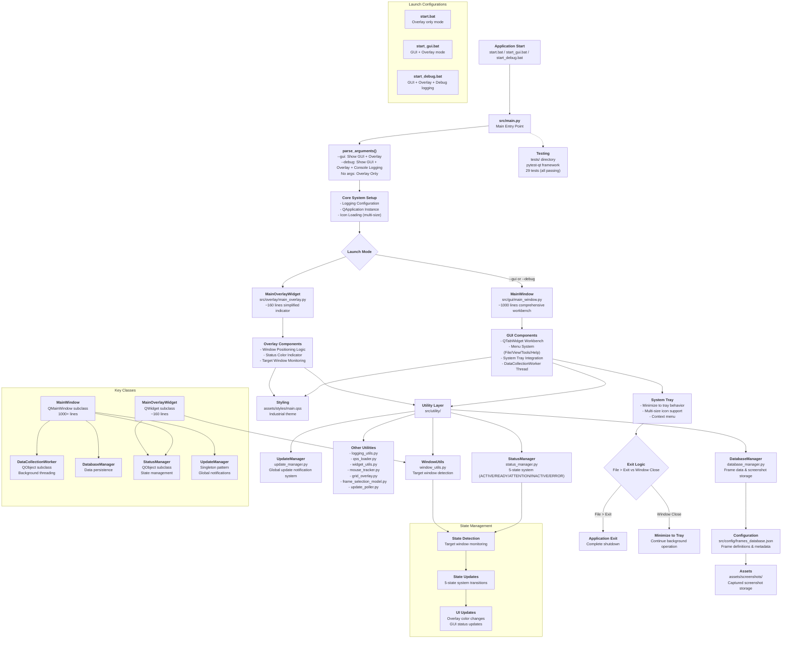

```mermaid
flowchart TD
%% Entry Points
START["`**Application Start**
start.bat / start_gui.bat / start_debug.bat`"] --> MAIN["`**src/main.py**
Main Entry Point`"]

    %% Argument Processing
    MAIN --> ARGS["`**parse_arguments()**
    --gui: Show GUI + Overlay
    --debug: Show GUI + Overlay + Console Logging
    No args: Overlay Only`"]

    %% Core Components Initialization
    ARGS --> CORE["`**Core System Setup**
    - Logging Configuration
    - QApplication Instance
    - Icon Loading (multi-size)`"]

    %% Window Management Decision
    CORE --> DECISION{"`**Launch Mode**`"}

    %% GUI Path
    DECISION -->|"--gui or --debug"| GUI_INIT["`**MainWindow**
    src/gui/main_window.py
    ~1000 lines comprehensive workbench`"]

    %% Overlay Path (Always)
    DECISION --> OVERLAY_INIT["`**MainOverlayWidget**
    src/overlay/main_overlay.py
    ~160 lines simplified indicator`"]

    %% GUI Structure
    GUI_INIT --> GUI_COMP["`**GUI Components**
    - QTabWidget Workbench
    - Menu System (File/View/Tools/Help)
    - System Tray Integration
    - DataCollectionWorker Thread`"]

    %% Overlay Structure
    OVERLAY_INIT --> OVERLAY_COMP["`**Overlay Components**
    - Window Positioning Logic
    - Status Color Indicator
    - Target Window Monitoring`"]

    %% Core Utility Layer
    GUI_COMP --> UTILS["`**Utility Layer**
    src/utility/`"]
    OVERLAY_COMP --> UTILS

    %% Utility Classes
    UTILS --> DB_MGR["`**DatabaseManager**
    database_manager.py
    Frame data & screenshot storage`"]

    UTILS --> STATUS_MGR["`**StatusManager**
    status_manager.py
    5-state system (ACTIVE/READY/ATTENTION/INACTIVE/ERROR)`"]

    UTILS --> UPDATE_MGR["`**UpdateManager**
    update_manager.py
    Global update notification system`"]

    UTILS --> WINDOW_UTILS["`**WindowUtils**
    window_utils.py
    Target window detection`"]

    UTILS --> OTHER_UTILS["`**Other Utilities**
    - logging_utils.py
    - qss_loader.py
    - widget_utils.py
    - mouse_tracker.py
    - grid_overlay.py
    - frame_selection_model.py
    - update_poller.py`"]

    %% Data Flow
    DB_MGR --> CONFIG["`**Configuration**
    src/config/frames_database.json
    Frame definitions & metadata`"]

    CONFIG --> ASSETS["`**Assets**
    assets/screenshots/
    Captured screenshot storage`"]

    %% System Tray Integration
    GUI_COMP --> TRAY["`**System Tray**
    - Minimize to tray behavior
    - Multi-size icon support
    - Context menu`"]

    %% Exit Behavior
    TRAY --> EXIT_LOGIC{"`**Exit Logic**
    File > Exit vs Window Close`"}
    EXIT_LOGIC -->|"File > Exit"| APP_EXIT["`**Application Exit**
    Complete shutdown`"]
    EXIT_LOGIC -->|"Window Close"| TRAY_MIN["`**Minimize to Tray**
    Continue background operation`"]

    %% Testing Framework
    MAIN -.-> TESTS["`**Testing**
    tests/ directory
    pytest-qt framework
    29 tests (all passing)`"]

    %% Styling
    GUI_COMP --> STYLES["`**Styling**
    assets/styles/main.qss
    Industrial theme`"]
    OVERLAY_COMP --> STYLES

    %% Launch Configurations Detail
    subgraph "Launch Configurations"
        BATCH1["`**start.bat**
        Overlay only mode`"]
        BATCH2["`**start_gui.bat**
        GUI + Overlay mode`"]
        BATCH3["`**start_debug.bat**
        GUI + Overlay + Debug logging`"]
    end

    %% State Management Flow
    subgraph "State Management"
        STATE_DETECT["`**State Detection**
        Target window monitoring`"] --> STATE_UPDATE["`**State Updates**
        5-state system transitions`"]
        STATE_UPDATE --> UI_UPDATE["`**UI Updates**
        Overlay color changes
        GUI status updates`"]
    end

    STATUS_MGR --> STATE_DETECT
    WINDOW_UTILS --> STATE_DETECT

    %% Class Relationships
    subgraph "Key Classes"
        MW["`**MainWindow**
        QMainWindow subclass
        1000+ lines`"]
        MOW["`**MainOverlayWidget**
        QWidget subclass
        ~160 lines`"]
        DCW["`**DataCollectionWorker**
        QObject subclass
        Background threading`"]
        DM["`**DatabaseManager**
        Data persistence`"]
        SM["`**StatusManager**
        QObject subclass
        State management`"]
        UM["`**UpdateManager**
        Singleton pattern
        Global notifications`"]
    end

    MW --> DCW
    MW --> DM
    MW --> SM
    MW --> UM
    MOW --> SM
    MOW --> WINDOW_UTILS
```
