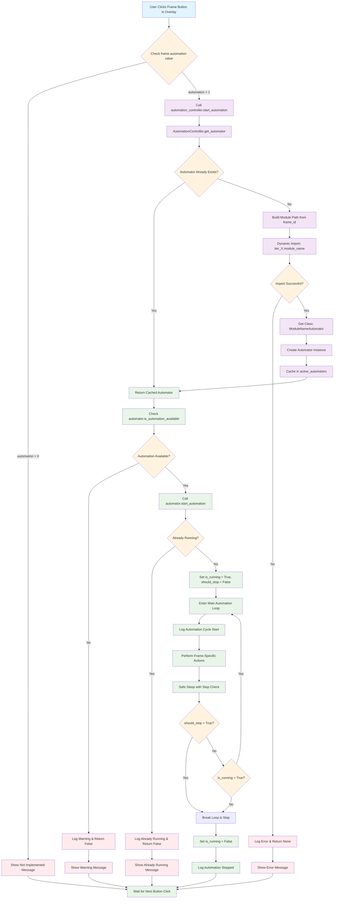

```mermaid
flowchart TD
    A[User Clicks Frame Button in Overlay] --> B{Check frame.automation value}

    B -->|automation = 0| C[Show Not Implemented Message]
    B -->|automation = 1| D[Call automation_controller.start_automation]

    C --> Z[Wait for Next Button Click]

    D --> E[AutomationController.get_automator]
    E --> F{Automator Already Exists?}

    F -->|Yes| G[Return Cached Automator]
    F -->|No| H[Build Module Path from frame_id]

    H --> I[Dynamic Import: tier_X.module_name]
    I --> J{Import Successful?}

    J -->|No| K[Log Error & Return None]
    J -->|Yes| L[Get Class: ModuleNameAutomator]

    L --> M[Create Automator Instance]
    M --> N[Cache in active_automators]
    N --> G

    G --> O[Check automator.is_automation_available]
    O --> P{Automation Available?}

    P -->|No| Q[Log Warning & Return False]
    P -->|Yes| R[Call automator.start_automation]

    R --> S{Already Running?}
    S -->|Yes| T[Log Already Running & Return False]
    S -->|No| U[Set is_running = True, should_stop = False]

    U --> V[Enter Main Automation Loop]
    V --> W[Log Automation Cycle Start]
    W --> X[Perform Frame-Specific Actions]
    X --> Y[Safe Sleep with Stop Check]

    Y --> AA{should_stop = True?}
    AA -->|Yes| BB[Break Loop & Stop]
    AA -->|No| CC{is_running = True?}

    CC -->|No| BB
    CC -->|Yes| V

    BB --> DD[Set is_running = False]
    DD --> EE[Log Automation Stopped]
    EE --> Z

    K --> FF[Show Error Message]
    Q --> GG[Show Warning Message]
    T --> HH[Show Already Running Message]

    FF --> Z
    GG --> Z
    HH --> Z

    %% Style the nodes
    classDef userAction fill:#e1f5fe
    classDef controller fill:#f3e5f5
    classDef automator fill:#e8f5e8
    classDef decision fill:#fff3e0
    classDef error fill:#ffebee
    classDef success fill:#e8f5e8

    class A userAction
    class D,E,H,I,L,M,N controller
    class G,O,R,U,V,W,X,Y,DD,EE automator
    class B,F,J,P,S,AA,CC decision
    class C,K,Q,T,FF,GG,HH error
    class Z success
```
